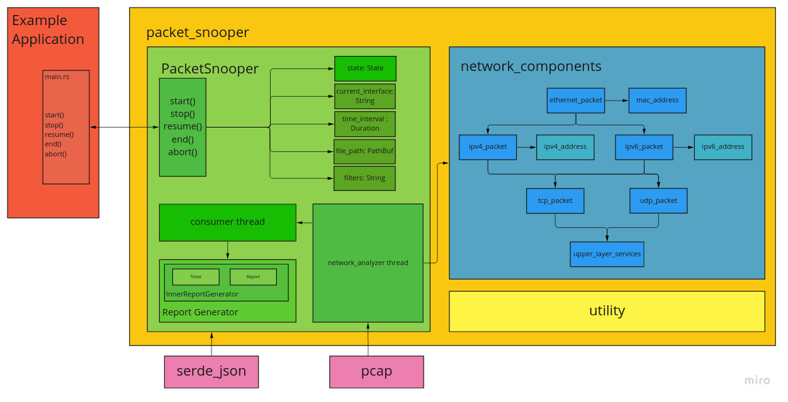

<div align="center">

# Packet-Snooper

</div>

[](https://opensource.org/licenses/MIT)
[](https://github.com/XXmorpheusX/PacketSnooper/actions/workflows/rust_workflow.yml)

`packet_snooper` is a cross-platform library to analyze network traffic data written using the Rust Programming Language.

It's available on Windows and UNIX-like Operating Systems such as Linux and macOS.

It was developed as part of a University project (Politecnico of Turin, Italy. "System and Device Programming". Year 2022).

<p align="center">
  
</p>


## TCP/IP Architecture Support
### Layer 2
````
full-support: EthernetII
identification: Ethernet802.3
future support: ()
````
### Layer 3 (Ethernet field "EtherType". IEEE 802.3)
````
full-support: IPv4, (IPv6), IPv6HopByHop
identification: ARP
future support: ()
````
### Layer 4 ("Protocol Type" field of L3 protocols)
````
full-support: UDP, (TCP)
identification: (). Others: IGMP, ICMPv4, ICMPv6
future support: ()
````
### Upper Layers
````
full-support: ()
identification: FTP=20, SSH=22, SMPT=23, DNS=53, HTTP=80, POP3=110
                SFTP=115, SNMP=161, BGP=179, HTTPS=443
future support: ()
````

## Architecture Overview & Internal State Machine design
<div>
    <p align="center">
      
    </p>
    <p align="center">
      
    </p>
</div>


## Technologies Used
- Main programming Language: Rust
- Version Control, Team Work: Git, GitHub

## Libraries (rust crates) used
- pcap
- serde
- serde_json

## Authors
- Alberto Foti
- Samuele Giannetto

<p align="center">
  
</p>
